# Projekt z programowania w języku python

Autor: Michał Koziński

Tematem projektu będzie pobranie, przygotowanie, przedstawienie i opis danych, a w końcowym rezultacie zbudowanie modelu liniowego. 

W tym celu pozyskam dane ze strony *Yahoo Finance* z których odczytam indeksowane wartości giełdowe poszczególnych dóbr.

Wczytywanie pakietów potrzebnych do późniejszych operacji.


```python
import numpy as np
import pandas as pd
import matplotlib.pyplot as plt
import yfinance as yf
import statsmodels.formula.api as smf
import scipy.stats as st
import seaborn as sns
```

## Pobieranie i oczyszczanie danych

Wczytywanie danych z *Yahoo Finance* za pomocą pakietu *yfinance* z okresu 01.01.2021 - 01.01.2022 do zbudowania modelu predykcyjnego.


```python
crude = yf.download(tickers='CL=F', start = '2021-01-01', end = '2022-01-01')
brent = yf.download(tickers='BZ=F', start = '2021-01-01', end = '2022-01-01')
wheat = yf.download(tickers='ZW=F', start = '2021-01-01', end = '2022-01-01')
gold = yf.download(tickers='GC=F', start = '2021-01-01', end = '2022-01-01')
silver = yf.download(tickers='SI=F', start = '2021-01-01', end = '2022-01-01')
sugar  = yf.download(tickers='SB=F', start = '2021-01-01', end = '2022-01-01')
copper = yf.download(tickers='HG=F', start = '2021-01-01', end = '2022-01-01')
nat_gas = yf.download(tickers='NG=F', start = '2021-01-01', end = '2022-01-01')
water = yf.download(tickers='H2O=F', start = '2021-01-01', end = '2022-01-01')
aluminium = yf.download(tickers='ALI=F', start = '2021-01-01', end = '2022-01-01')
coffe = yf.download(tickers='KC=F', start = '2021-01-01', end = '2022-01-01')
corn = yf.download(tickers='ZC=F', start = '2021-01-01', end = '2022-01-01')
gasoline = yf.download(tickers='RB=F', start = '2021-01-01', end = '2022-01-01')
```

    [*********************100%***********************]  1 of 1 completed
    [*********************100%***********************]  1 of 1 completed
    [*********************100%***********************]  1 of 1 completed
    [*********************100%***********************]  1 of 1 completed
    [*********************100%***********************]  1 of 1 completed
    [*********************100%***********************]  1 of 1 completed
    [*********************100%***********************]  1 of 1 completed
    [*********************100%***********************]  1 of 1 completed
    [*********************100%***********************]  1 of 1 completed
    [*********************100%***********************]  1 of 1 completed
    [*********************100%***********************]  1 of 1 completed
    [*********************100%***********************]  1 of 1 completed
    [*********************100%***********************]  1 of 1 completed
    

Wyświetlenie pierwszych wierszy wraz ze strukturą pobranych danych.


```python
gasoline.head()
```


<div>
<style scoped>
    .dataframe tbody tr th:only-of-type {
        vertical-align: middle;
    }

    .dataframe tbody tr th {
        vertical-align: top;
    }

    .dataframe thead th {
        text-align: right;
    }
</style>
<table border="1" class="dataframe">
  <thead>
    <tr style="text-align: right;">
      <th></th>
      <th>Open</th>
      <th>High</th>
      <th>Low</th>
      <th>Close</th>
      <th>Adj Close</th>
      <th>Volume</th>
    </tr>
    <tr>
      <th>Date</th>
      <th></th>
      <th></th>
      <th></th>
      <th></th>
      <th></th>
      <th></th>
    </tr>
  </thead>
  <tbody>
    <tr>
      <th>2020-12-31</th>
      <td>1.4078</td>
      <td>1.4238</td>
      <td>1.3966</td>
      <td>1.4084</td>
      <td>1.4084</td>
      <td>60206</td>
    </tr>
    <tr>
      <th>2021-01-04</th>
      <td>1.4085</td>
      <td>1.4516</td>
      <td>1.3620</td>
      <td>1.3729</td>
      <td>1.3729</td>
      <td>71981</td>
    </tr>
    <tr>
      <th>2021-01-05</th>
      <td>1.3660</td>
      <td>1.4586</td>
      <td>1.3618</td>
      <td>1.4521</td>
      <td>1.4521</td>
      <td>74245</td>
    </tr>
    <tr>
      <th>2021-01-06</th>
      <td>1.4439</td>
      <td>1.4931</td>
      <td>1.4404</td>
      <td>1.4750</td>
      <td>1.4750</td>
      <td>68827</td>
    </tr>
    <tr>
      <th>2021-01-07</th>
      <td>1.4703</td>
      <td>1.4879</td>
      <td>1.4641</td>
      <td>1.4827</td>
      <td>1.4827</td>
      <td>53441</td>
    </tr>
  </tbody>
</table>
</div>


Do modelu użyję wartości z kolumny "Close".

Za pomocą biblioteki *Pandas* tworzę ramkę danych z wartości w kolumnach *Close* dla poszczególnych dóbr.


```python
dane=pd.DataFrame({'ropa':crude.Close,
                   'brent':brent.Close,
                   'paliwo':gasoline.Close,
                   'zloto':gold.Close,
                   'srebro':silver.Close,
                   'miedz':copper.Close,
                   'aluminium':aluminium.Close,
                   'gaz_ziemny':nat_gas.Close,
                   'woda':water.Close,
                   'cukier':sugar.Close,
                   'kawa':coffe.Close,
                   'pszenica':wheat.Close,
                   'kukurydza':corn.Close})
```

Dla podglądu wyświetlam pierwsze 10 wersów ramki danych.


```python
dane.head(10)
```


<div>
<style scoped>
    .dataframe tbody tr th:only-of-type {
        vertical-align: middle;
    }

    .dataframe tbody tr th {
        vertical-align: top;
    }

    .dataframe thead th {
        text-align: right;
    }
</style>
<table border="1" class="dataframe">
  <thead>
    <tr style="text-align: right;">
      <th></th>
      <th>ropa</th>
      <th>brent</th>
      <th>paliwo</th>
      <th>zloto</th>
      <th>srebro</th>
      <th>miedz</th>
      <th>aluminium</th>
      <th>gaz_ziemny</th>
      <th>woda</th>
      <th>cukier</th>
      <th>kawa</th>
      <th>pszenica</th>
      <th>kukurydza</th>
    </tr>
    <tr>
      <th>Date</th>
      <th></th>
      <th></th>
      <th></th>
      <th></th>
      <th></th>
      <th></th>
      <th></th>
      <th></th>
      <th></th>
      <th></th>
      <th></th>
      <th></th>
      <th></th>
    </tr>
  </thead>
  <tbody>
    <tr>
      <th>2020-12-31</th>
      <td>48.520000</td>
      <td>NaN</td>
      <td>1.4084</td>
      <td>1893.099976</td>
      <td>26.332001</td>
      <td>3.5140</td>
      <td>1990.00</td>
      <td>2.539</td>
      <td>496.0</td>
      <td>15.490000</td>
      <td>128.250000</td>
      <td>640.50</td>
      <td>484.00</td>
    </tr>
    <tr>
      <th>2021-01-04</th>
      <td>47.619999</td>
      <td>51.090000</td>
      <td>1.3729</td>
      <td>1944.699951</td>
      <td>27.284000</td>
      <td>3.5530</td>
      <td>2023.25</td>
      <td>2.581</td>
      <td>505.0</td>
      <td>15.760000</td>
      <td>126.150002</td>
      <td>642.00</td>
      <td>483.75</td>
    </tr>
    <tr>
      <th>2021-01-05</th>
      <td>49.930000</td>
      <td>53.599998</td>
      <td>1.4521</td>
      <td>1952.699951</td>
      <td>27.570999</td>
      <td>3.6405</td>
      <td>2050.00</td>
      <td>2.702</td>
      <td>501.0</td>
      <td>16.120001</td>
      <td>125.099998</td>
      <td>654.00</td>
      <td>491.75</td>
    </tr>
    <tr>
      <th>2021-01-06</th>
      <td>50.630001</td>
      <td>54.299999</td>
      <td>1.4750</td>
      <td>1906.900024</td>
      <td>26.973000</td>
      <td>3.6500</td>
      <td>2038.00</td>
      <td>2.716</td>
      <td>504.0</td>
      <td>16.250000</td>
      <td>120.900002</td>
      <td>647.50</td>
      <td>495.00</td>
    </tr>
    <tr>
      <th>2021-01-07</th>
      <td>50.830002</td>
      <td>54.380001</td>
      <td>1.4827</td>
      <td>1912.300049</td>
      <td>27.200001</td>
      <td>3.6955</td>
      <td>2039.25</td>
      <td>2.729</td>
      <td>504.0</td>
      <td>15.600000</td>
      <td>121.099998</td>
      <td>642.25</td>
      <td>494.00</td>
    </tr>
    <tr>
      <th>2021-01-08</th>
      <td>52.240002</td>
      <td>55.990002</td>
      <td>1.5423</td>
      <td>1834.099976</td>
      <td>24.582001</td>
      <td>3.6735</td>
      <td>2022.25</td>
      <td>2.700</td>
      <td>504.0</td>
      <td>15.600000</td>
      <td>123.699997</td>
      <td>638.75</td>
      <td>496.25</td>
    </tr>
    <tr>
      <th>2021-01-11</th>
      <td>52.250000</td>
      <td>55.660000</td>
      <td>1.5208</td>
      <td>1849.599976</td>
      <td>25.239000</td>
      <td>3.5640</td>
      <td>2000.75</td>
      <td>2.747</td>
      <td>498.0</td>
      <td>15.670000</td>
      <td>121.449997</td>
      <td>634.75</td>
      <td>492.25</td>
    </tr>
    <tr>
      <th>2021-01-12</th>
      <td>53.209999</td>
      <td>56.580002</td>
      <td>1.5530</td>
      <td>1842.900024</td>
      <td>25.384001</td>
      <td>3.6050</td>
      <td>2015.50</td>
      <td>2.753</td>
      <td>498.0</td>
      <td>15.460000</td>
      <td>121.400002</td>
      <td>665.00</td>
      <td>517.25</td>
    </tr>
    <tr>
      <th>2021-01-13</th>
      <td>52.910000</td>
      <td>56.060001</td>
      <td>1.5488</td>
      <td>1853.599976</td>
      <td>25.520000</td>
      <td>3.6170</td>
      <td>2007.50</td>
      <td>2.727</td>
      <td>499.0</td>
      <td>15.840000</td>
      <td>125.250000</td>
      <td>660.50</td>
      <td>524.50</td>
    </tr>
    <tr>
      <th>2021-01-14</th>
      <td>53.570000</td>
      <td>56.419998</td>
      <td>1.5539</td>
      <td>1850.300049</td>
      <td>25.746000</td>
      <td>3.6680</td>
      <td>1997.75</td>
      <td>2.666</td>
      <td>503.0</td>
      <td>16.670000</td>
      <td>127.349998</td>
      <td>670.00</td>
      <td>534.25</td>
    </tr>
  </tbody>
</table>
</div>


Jak widać wartości nie były indeksowane każdego dnia.

Ze względu na zauważone braki, zliczam ile z nich występuje dla każdego dobra.


```python
[sum(np.isnan(dane.ropa)),
 sum(np.isnan(dane.brent)),
 sum(np.isnan(dane.paliwo)),
 sum(np.isnan(dane.zloto)),
 sum(np.isnan(dane.srebro)),
 sum(np.isnan(dane.miedz)),
 sum(np.isnan(dane.aluminium)),
 sum(np.isnan(dane.gaz_ziemny)),
 sum(np.isnan(dane.woda)),
 sum(np.isnan(dane.cukier)),
 sum(np.isnan(dane.kawa)),
 sum(np.isnan(dane.pszenica)),
 sum(np.isnan(dane.kukurydza))]
```


    [0, 2, 0, 0, 1, 0, 1, 0, 26, 0, 0, 1, 1]


Niekwestionowanym liderem w ilości braków danych jest *woda*, która w porównaniu do innych dóbr ma aż 26.

Wyświetlam zatem w których wierszach występują braki dla *wody*


```python
np.where(np.isnan(dane.woda))
```


    (array([204, 205, 206, 207, 208, 209, 210, 211, 212, 213, 214, 215, 216,
            217, 218, 219, 220, 221, 222, 223, 224, 225, 226, 227, 228, 229],
           dtype=int64),)


Sprawdzam ile zindeksowanych wartości ma *paliwo*. Ze względu na niewystępujące dla tego dobra braki danych, będę mógł sprawdzić w ilu dniach spośród 366 wartości zostały zindeksowane.


```python
len(dane.paliwo)
```


    254


Wartości dla dóbr bez braków danych zostały zindeksowane 254 razy.

Jak można się doyśleć wartości dla *wody* zostałe zindeksowane 26 razy mniej. Przy tak dużej różnicy braków danych, można założyć, że dni z brakami dla *wody* obejmą większość dni z brakami dla pozostałych dóbr. Przy usuwaniu braków danych, można spodziewać straty od 26 do 32 indeksów.

Stwierdzam, że zawężenie zbioru danych o taką liczbę dni, nie wpłynie w znaczący sposób na końcowy rezultat, więc pozbywam się wszytkich wierszy, gdzie występują braki danych.


```python
df = dane.dropna()
```

Jeszcze raz sprawdzam ile zindeksowanych wartości pozostało, aby upewnić się czy usunięcie braków danych nie uszczupliło za bardzo zbioru.


```python
len(df.paliwo)
```


    226


Usunięcie braków danych poskutkowało usunieciem danych z 28 dni.

## Przedstawienie i opis pozyskanych danych


```python
df.head()
```


<div>
<style scoped>
    .dataframe tbody tr th:only-of-type {
        vertical-align: middle;
    }

    .dataframe tbody tr th {
        vertical-align: top;
    }

    .dataframe thead th {
        text-align: right;
    }
</style>
<table border="1" class="dataframe">
  <thead>
    <tr style="text-align: right;">
      <th></th>
      <th>ropa</th>
      <th>brent</th>
      <th>paliwo</th>
      <th>zloto</th>
      <th>srebro</th>
      <th>miedz</th>
      <th>aluminium</th>
      <th>gaz_ziemny</th>
      <th>woda</th>
      <th>cukier</th>
      <th>kawa</th>
      <th>pszenica</th>
      <th>kukurydza</th>
    </tr>
    <tr>
      <th>Date</th>
      <th></th>
      <th></th>
      <th></th>
      <th></th>
      <th></th>
      <th></th>
      <th></th>
      <th></th>
      <th></th>
      <th></th>
      <th></th>
      <th></th>
      <th></th>
    </tr>
  </thead>
  <tbody>
    <tr>
      <th>2021-01-04</th>
      <td>47.619999</td>
      <td>51.090000</td>
      <td>1.3729</td>
      <td>1944.699951</td>
      <td>27.284000</td>
      <td>3.5530</td>
      <td>2023.25</td>
      <td>2.581</td>
      <td>505.0</td>
      <td>15.760000</td>
      <td>126.150002</td>
      <td>642.00</td>
      <td>483.75</td>
    </tr>
    <tr>
      <th>2021-01-05</th>
      <td>49.930000</td>
      <td>53.599998</td>
      <td>1.4521</td>
      <td>1952.699951</td>
      <td>27.570999</td>
      <td>3.6405</td>
      <td>2050.00</td>
      <td>2.702</td>
      <td>501.0</td>
      <td>16.120001</td>
      <td>125.099998</td>
      <td>654.00</td>
      <td>491.75</td>
    </tr>
    <tr>
      <th>2021-01-06</th>
      <td>50.630001</td>
      <td>54.299999</td>
      <td>1.4750</td>
      <td>1906.900024</td>
      <td>26.973000</td>
      <td>3.6500</td>
      <td>2038.00</td>
      <td>2.716</td>
      <td>504.0</td>
      <td>16.250000</td>
      <td>120.900002</td>
      <td>647.50</td>
      <td>495.00</td>
    </tr>
    <tr>
      <th>2021-01-07</th>
      <td>50.830002</td>
      <td>54.380001</td>
      <td>1.4827</td>
      <td>1912.300049</td>
      <td>27.200001</td>
      <td>3.6955</td>
      <td>2039.25</td>
      <td>2.729</td>
      <td>504.0</td>
      <td>15.600000</td>
      <td>121.099998</td>
      <td>642.25</td>
      <td>494.00</td>
    </tr>
    <tr>
      <th>2021-01-08</th>
      <td>52.240002</td>
      <td>55.990002</td>
      <td>1.5423</td>
      <td>1834.099976</td>
      <td>24.582001</td>
      <td>3.6735</td>
      <td>2022.25</td>
      <td>2.700</td>
      <td>504.0</td>
      <td>15.600000</td>
      <td>123.699997</td>
      <td>638.75</td>
      <td>496.25</td>
    </tr>
  </tbody>
</table>
</div>


Pozyskane we wcześniej opisywanym procesie dane prezentują się w powyższy sposób. 

Są one zindeksowanymi wartościami dóbr takich jak: ropa, brent (ropa pozyskana z Morza Północnego), paliwo, złoto, srebro, aluminium, gaz ziemny, woda, cukier, kawa, pszenica, kukurydza.

Wyświetlę teraz statystyki odpisowe zebranych danych.


```python
df.describe(include='all')
```


<div>
<style scoped>
    .dataframe tbody tr th:only-of-type {
        vertical-align: middle;
    }

    .dataframe tbody tr th {
        vertical-align: top;
    }

    .dataframe thead th {
        text-align: right;
    }
</style>
<table border="1" class="dataframe">
  <thead>
    <tr style="text-align: right;">
      <th></th>
      <th>ropa</th>
      <th>brent</th>
      <th>paliwo</th>
      <th>zloto</th>
      <th>srebro</th>
      <th>miedz</th>
      <th>aluminium</th>
      <th>gaz_ziemny</th>
      <th>woda</th>
      <th>cukier</th>
      <th>kawa</th>
      <th>pszenica</th>
      <th>kukurydza</th>
    </tr>
  </thead>
  <tbody>
    <tr>
      <th>count</th>
      <td>226.000000</td>
      <td>226.000000</td>
      <td>226.000000</td>
      <td>226.000000</td>
      <td>226.000000</td>
      <td>226.000000</td>
      <td>226.000000</td>
      <td>226.000000</td>
      <td>226.000000</td>
      <td>226.000000</td>
      <td>226.000000</td>
      <td>226.000000</td>
      <td>226.000000</td>
    </tr>
    <tr>
      <th>mean</th>
      <td>66.726637</td>
      <td>69.685310</td>
      <td>2.072720</td>
      <td>1795.603981</td>
      <td>25.227973</td>
      <td>4.232204</td>
      <td>2478.620575</td>
      <td>3.556712</td>
      <td>774.263009</td>
      <td>17.668982</td>
      <td>163.821460</td>
      <td>691.700221</td>
      <td>583.039823</td>
    </tr>
    <tr>
      <th>std</th>
      <td>7.384079</td>
      <td>7.149457</td>
      <td>0.235499</td>
      <td>50.460590</td>
      <td>1.845723</td>
      <td>0.293330</td>
      <td>295.509451</td>
      <td>0.931408</td>
      <td>154.301452</td>
      <td>1.494628</td>
      <td>35.683909</td>
      <td>51.254404</td>
      <td>64.532154</td>
    </tr>
    <tr>
      <th>min</th>
      <td>47.619999</td>
      <td>51.090000</td>
      <td>1.372900</td>
      <td>1677.699951</td>
      <td>21.459000</td>
      <td>3.539000</td>
      <td>1929.500000</td>
      <td>2.446000</td>
      <td>497.000000</td>
      <td>14.710000</td>
      <td>120.900002</td>
      <td>601.750000</td>
      <td>483.750000</td>
    </tr>
    <tr>
      <th>25%</th>
      <td>61.552500</td>
      <td>65.332500</td>
      <td>1.971175</td>
      <td>1763.300049</td>
      <td>23.675000</td>
      <td>4.117000</td>
      <td>2248.750000</td>
      <td>2.777000</td>
      <td>683.500000</td>
      <td>16.422500</td>
      <td>130.062504</td>
      <td>650.000000</td>
      <td>539.312500</td>
    </tr>
    <tr>
      <th>50%</th>
      <td>67.355000</td>
      <td>69.774998</td>
      <td>2.130750</td>
      <td>1790.149963</td>
      <td>25.517500</td>
      <td>4.278000</td>
      <td>2500.250000</td>
      <td>3.252000</td>
      <td>852.500000</td>
      <td>17.530001</td>
      <td>153.975006</td>
      <td>681.125000</td>
      <td>557.875000</td>
    </tr>
    <tr>
      <th>75%</th>
      <td>72.030003</td>
      <td>74.412498</td>
      <td>2.229100</td>
      <td>1824.175049</td>
      <td>26.409501</td>
      <td>4.388875</td>
      <td>2617.562500</td>
      <td>4.039750</td>
      <td>898.500000</td>
      <td>18.980000</td>
      <td>189.375000</td>
      <td>726.875000</td>
      <td>623.437500</td>
    </tr>
    <tr>
      <th>max</th>
      <td>83.870003</td>
      <td>85.820000</td>
      <td>2.508400</td>
      <td>1952.699951</td>
      <td>29.398001</td>
      <td>4.778500</td>
      <td>3202.500000</td>
      <td>6.312000</td>
      <td>956.000000</td>
      <td>20.330000</td>
      <td>250.199997</td>
      <td>814.750000</td>
      <td>772.750000</td>
    </tr>
  </tbody>
</table>
</div>


```python
print('Mediany wartości poszczególnych dóbr')
print(df.median())

print('Skośność dla poszczególnych dóbr')
print(df.skew())
```

    Mediany wartości poszczególnych dóbr
    ropa            67.355000
    brent           69.774998
    paliwo           2.130750
    zloto         1790.149963
    srebro          25.517500
    miedz            4.278000
    aluminium     2500.250000
    gaz_ziemny       3.252000
    woda           852.500000
    cukier          17.530001
    kawa           153.975006
    pszenica       681.125000
    kukurydza      557.875000
    dtype: float64
    Mediany wartości poszczególnych dóbr
    ropa         -0.240660
    brent        -0.260381
    paliwo       -1.026203
    zloto         0.483195
    srebro       -0.161737
    miedz        -0.657610
    aluminium     0.188756
    gaz_ziemny    0.903349
    woda         -0.710489
    cukier        0.021032
    kawa          0.645516
    pszenica      0.477676
    kukurydza     0.997061
    dtype: float64
    

Spośród wszystkich dóbr wyłaniają się 2 dobra, które szczególnie warto ze sobą porównać. Mianowicie są to *ropa* i *brent*, które przedstawiają ceny ropy naftowej.

Jak widać ropa wydobywana na Morzu Północnym jest droższa od ogólnego indeksu ropy naftowej.

W celu zobrazowania różnic wyświtelę wykresy pudełkowe ich cen. 


```python
fig = plt.figure(figsize=(15,15), facecolor='white')
sns.set(style='darkgrid')

fig.add_subplot(1,2,1)
sns.boxplot(y=df.ropa, color='yellow')
plt.title('Ropa')
plt.ylim(40, 90)
plt.ylabel('')

fig.add_subplot(1,2,2)
sns.boxplot(y=df.brent, color='lightblue')
plt.title('Brent')
plt.ylim(40, 90)
plt.ylabel('')
```


    Text(0, 0.5, '')


    
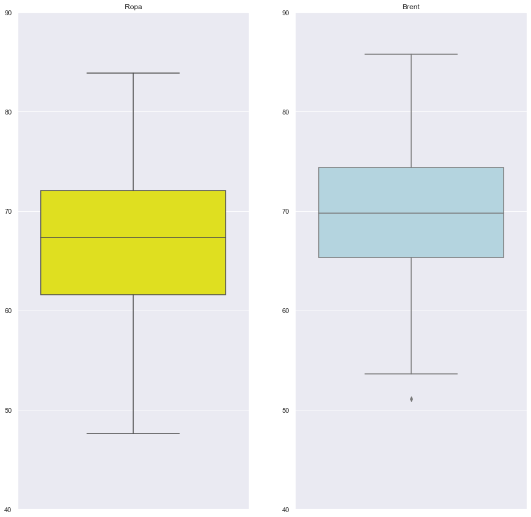
    


Jak widać wykresy pokrywają się z wcześniejszymi obserwacjami, ponadto można zaobserwować, że ceny *brentu* charakteryzują się delikatnie mniejszą wariancją.

Wykonam teraz przedstawienie danych dla *ropy* w szeregu rozdzielczym.


```python
klasy = np.linspace(min(df.ropa), max(df.ropa), 14)
ds = (pd.value_counts(pd.cut(df.ropa, klasy))).sort_values()
x = np.array(ds.index.categories).astype('str')
```


```python
f = plt.figure()
f.set_figwidth(21)
f.set_figheight(15)

plt.bar(x,ds.values)
```


    <BarContainer object of 13 artists>


    
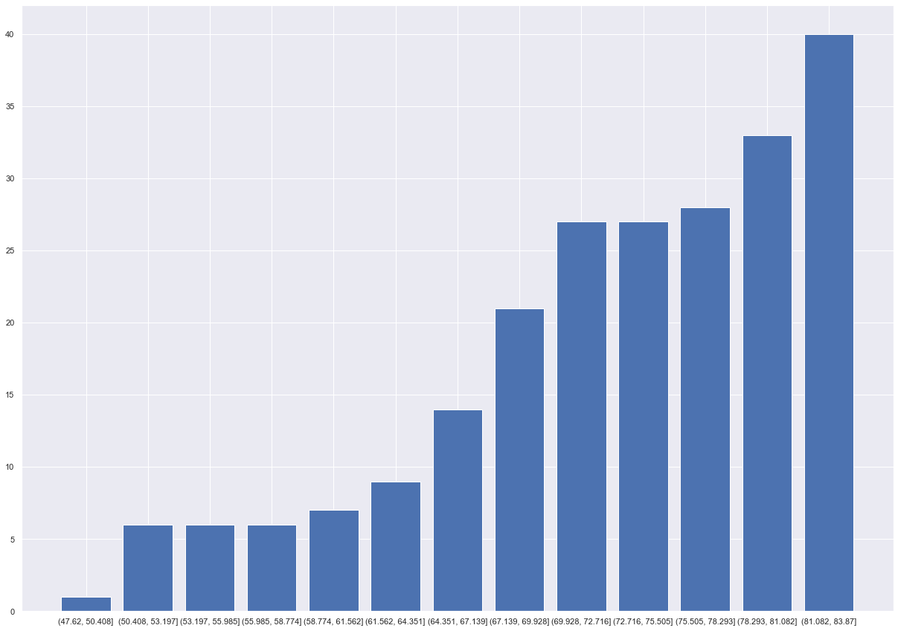
    


Wyświetlę też boxploty wartości innych dóbr, dla zobrazwoania tego jak się rozkładają.


```python
fig2 = plt.figure(figsize=(15,10), facecolor='white')
sns.set(style='darkgrid')

fig2.add_subplot(1,4,1)
sns.boxplot(y=df.zloto, color='grey')
plt.title('Złoto')
plt.ylabel('')

fig2.add_subplot(1,4,2)
sns.boxplot(y=df.srebro, color='grey')
plt.title('Srebro')
plt.ylabel('')

fig2.add_subplot(1,4,3)
sns.boxplot(y=df.miedz, color='grey')
plt.title('Miedź')
plt.ylabel('')

fig2.add_subplot(1,4,4)
sns.boxplot(y=df.aluminium, color='grey')
plt.title('Aluminium')
plt.ylabel('')
```


    Text(0, 0.5, '')


    
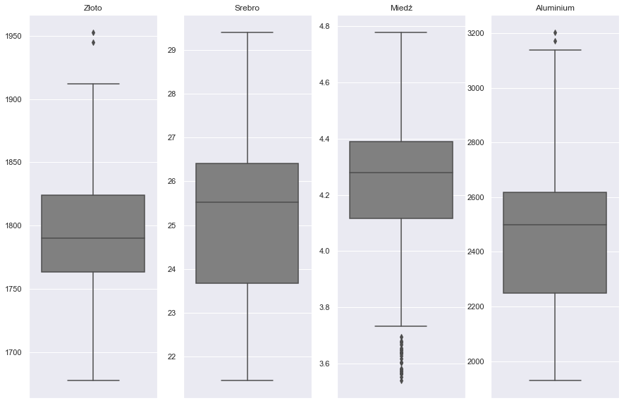
    


Sprawdzę teraz jak czy wartości *paliwa* mają rozkład normalny.

Na początku narysuję 3 wykresy dzieki kótrym będzie mozna zobaczyć, czy rozkład cen pokrywa się, czy odbiega od rozkładu normalnego.


```python
from statsmodels.distributions.empirical_distribution import ECDF

dist_norm = st.norm.fit(df.paliwo)
x = np.linspace(min(df.paliwo), max(df.paliwo), 226)

fig, ax = plt.subplots(1,2,facecolor='white',figsize=(14,6))

ax[0].hist(df.paliwo,density=True, color='blue', label='histogram')
ax[0].plot(x, st.norm(loc = dist_norm[0], scale = dist_norm[1]).pdf(x), color='red', label='funkcja gestosci')
ax[0].legend()
ax[0].set_title('histogram')

ecdf=ECDF(df.paliwo)
ax[1].step(ecdf.x, ecdf.y, color='blue', label='empiryczna')
ax[1].plot(x,st.norm(loc=dist_norm[0], scale=dist_norm[1]).cdf(x), color='red', label = 'teoretyczna')
ax[1].legend(title='rozklad')
ax[1].grid()
ax[1].set_title('dystrybuanty')

plt.show()

st.probplot(df.paliwo, dist=st.norm, plot=plt)
plt.title('Wykres Q-Q')
plt.xlabel('Kwantyle')
plt.ylabel('Wartości')
plt.show()
```


    
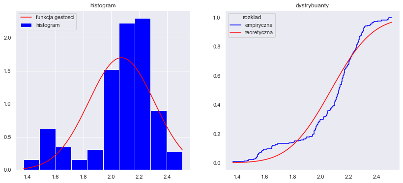
    


    
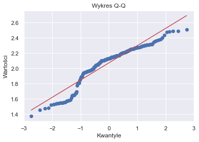
    


Jak widać rozkład cen *paliwa* nie pokrywa się z rozkładem normalnym.

Dla pewności przeprowadzę jeszcze test Szapiro-Wilka.
Oczywiście hipotezą zerową jest, że rozkład zmiennej *paliwo* ma rozkład normalny, a hipotezą alternatywną, że zmienna nie ma rozkładu normalnego.


```python
shapiro_test = st.shapiro(df.paliwo)
shapiro_test
```


    ShapiroResult(statistic=0.9033753275871277, pvalue=6.631251103783598e-11)


Przy tak niskim p-value nie ma żadnych wątpliwości, że należy odrzucić hipotezę zerową na rzecz hipotezy alternatywnej.

## Tworzenie modelu liniowego

W celu doboru zmiennych do stworzenia modelu liniwego posłużę się macierzą korelacji, żeby móc wstepnie ocenić, czy wartości poszczególnych dóbr są ze sobą skorelowane. 

Jako zmienną objaśnianą wybrałem cenę *paliwa*. 

Dla przejrzystości podzielę dane na dwie części i stworzę 2 oodzielne macierze, w obu z nich zawarta będzie zmienna *paliwo*.


```python
plt.figure(facecolor='white')
pd.plotting.scatter_matrix(df.iloc[:,[2,0,1,3,4,5,6]], marker='o', figsize=(30,30), diagonal='hist', 
                                                              hist_kwds={'bins': 10,
                                                                        'color': 'green'})
plt.show()
```


    <Figure size 432x288 with 0 Axes>


    
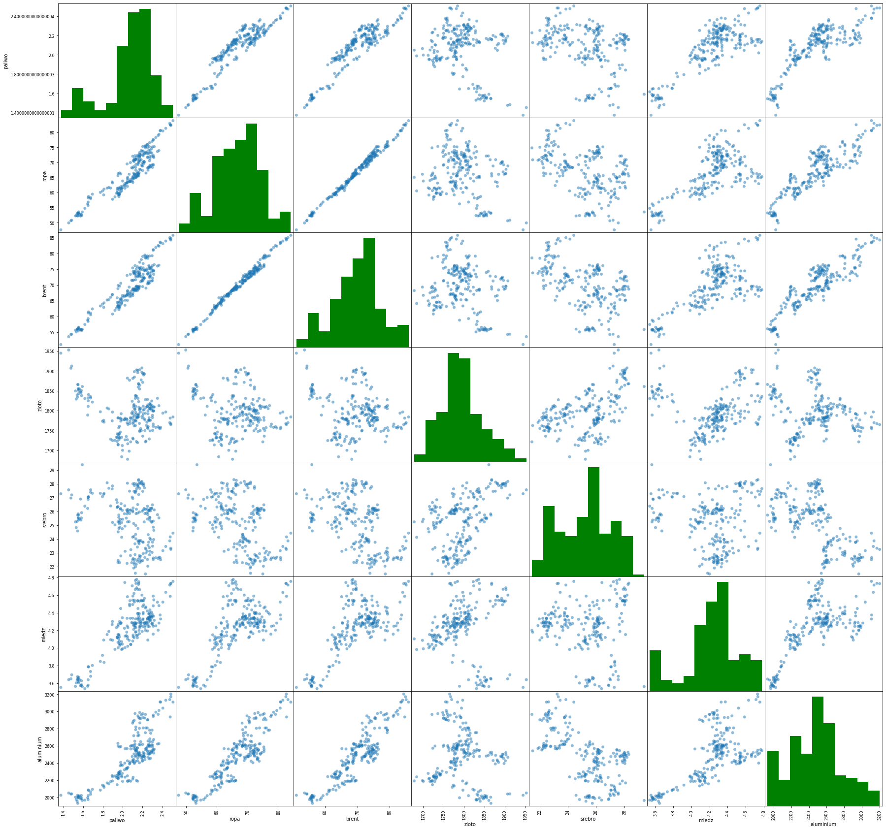
    


```python
plt.figure(facecolor='white')
pd.plotting.scatter_matrix(df.iloc[:,[2,7,8,9,10,11,12]], marker='o', figsize=(30,30), diagonal='hist', 
                                                              hist_kwds={'bins': 10,
                                                                        'color': 'green'})
plt.show()
```


    <Figure size 432x288 with 0 Axes>


    
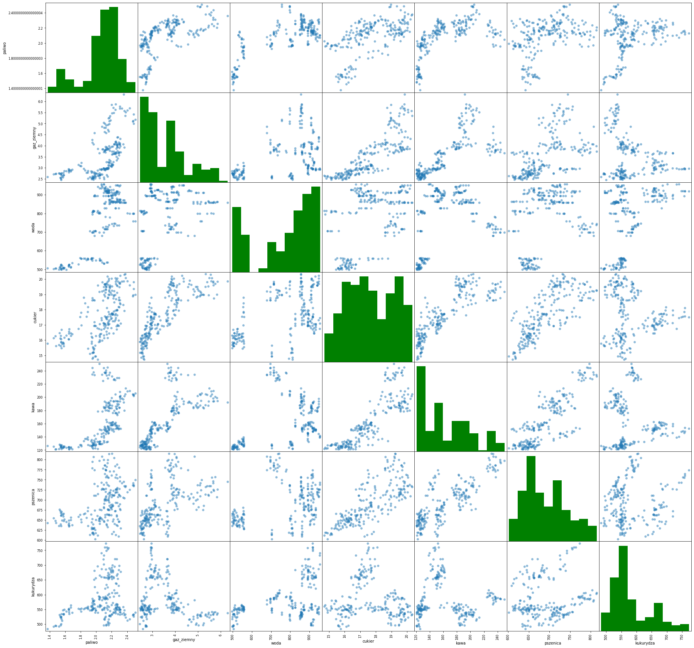
    


Na podstawie macierzy widać, że najbardziej skorelowane z ceną *paliwa* są wartości *ropy* i *brentu*.


```python
plt.figure(facecolor='white')
pd.plotting.scatter_matrix(df.iloc[:,0:3], marker='o', figsize=(30,30), diagonal='hist', 
                                                              hist_kwds={'bins': 10,
                                                                        'color': 'green'})
plt.show()
```


    <Figure size 432x288 with 0 Axes>


    
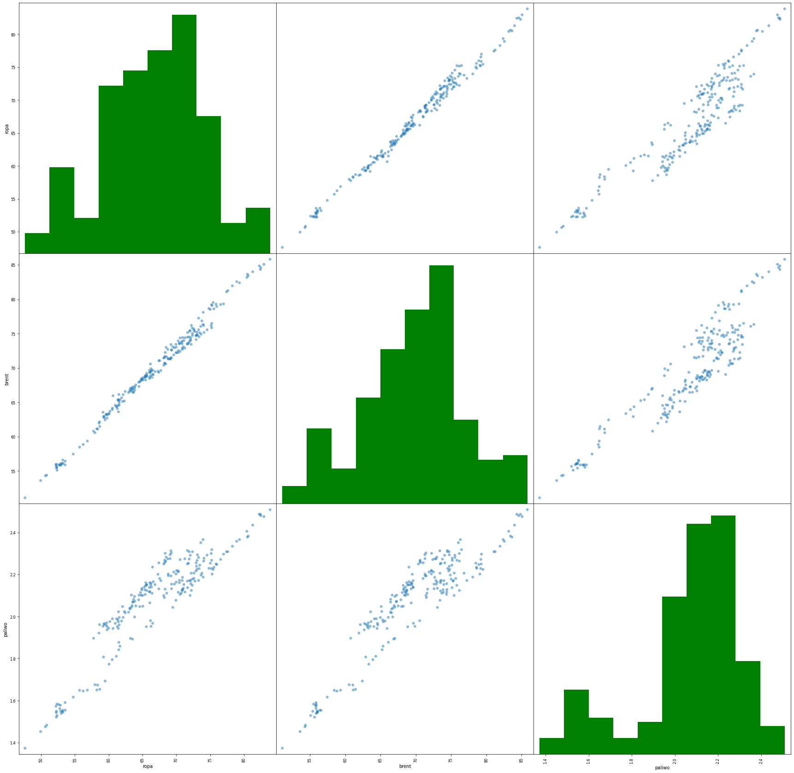
    


W pierwszym modelu do objaśniania ceny *paliwa* posłużę się wartością *ropy*.


```python
regresja = smf.ols(formula = 'paliwo ~ ropa', data = df)
wynik = regresja.fit()
wynik.summary()
```


<table class="simpletable">
<caption>OLS Regression Results</caption>
<tr>
  <th>Dep. Variable:</th>         <td>paliwo</td>      <th>  R-squared:         </th> <td>   0.857</td>
</tr>
<tr>
  <th>Model:</th>                   <td>OLS</td>       <th>  Adj. R-squared:    </th> <td>   0.856</td>
</tr>
<tr>
  <th>Method:</th>             <td>Least Squares</td>  <th>  F-statistic:       </th> <td>   1340.</td>
</tr>
<tr>
  <th>Date:</th>             <td>Fri, 17 Jun 2022</td> <th>  Prob (F-statistic):</th> <td>1.75e-96</td>
</tr>
<tr>
  <th>Time:</th>                 <td>23:16:10</td>     <th>  Log-Likelihood:    </th> <td>  226.20</td>
</tr>
<tr>
  <th>No. Observations:</th>      <td>   226</td>      <th>  AIC:               </th> <td>  -448.4</td>
</tr>
<tr>
  <th>Df Residuals:</th>          <td>   224</td>      <th>  BIC:               </th> <td>  -441.6</td>
</tr>
<tr>
  <th>Df Model:</th>              <td>     1</td>      <th>                     </th>     <td> </td>   
</tr>
<tr>
  <th>Covariance Type:</th>      <td>nonrobust</td>    <th>                     </th>     <td> </td>   
</tr>
</table>
<table class="simpletable">
<tr>
      <td></td>         <th>coef</th>     <th>std err</th>      <th>t</th>      <th>P>|t|</th>  <th>[0.025</th>    <th>0.975]</th>  
</tr>
<tr>
  <th>Intercept</th> <td>    0.1029</td> <td>    0.054</td> <td>    1.901</td> <td> 0.059</td> <td>   -0.004</td> <td>    0.210</td>
</tr>
<tr>
  <th>ropa</th>      <td>    0.0295</td> <td>    0.001</td> <td>   36.602</td> <td> 0.000</td> <td>    0.028</td> <td>    0.031</td>
</tr>
</table>
<table class="simpletable">
<tr>
  <th>Omnibus:</th>       <td>201.589</td> <th>  Durbin-Watson:     </th> <td>   0.075</td>
</tr>
<tr>
  <th>Prob(Omnibus):</th> <td> 0.000</td>  <th>  Jarque-Bera (JB):  </th> <td>  15.788</td>
</tr>
<tr>
  <th>Skew:</th>          <td> 0.039</td>  <th>  Prob(JB):          </th> <td>0.000373</td>
</tr>
<tr>
  <th>Kurtosis:</th>      <td> 1.708</td>  <th>  Cond. No.          </th> <td>    612.</td>
</tr>
</table><br/><br/>Notes:<br/>[1] Standard Errors assume that the covariance matrix of the errors is correctly specified.


Model prezentował by się w następujący sposób:

$paliwo = 0.03 * ropa + ε$

Wartość $0.1$ w rozkładzie jest statystycznie nieistotna.


```python
plt.plot(df.paliwo, df.ropa, linestyle='', marker='o', color='blue')
#plt.plot(df.paliwo, wynik.predict(df.paliwo), linestyle='solid', color='red')
plt.xlabel('cena paliwa')
plt.ylabel('cena ropy')
plt.title('Zależność cen ')
plt.show()
```


    
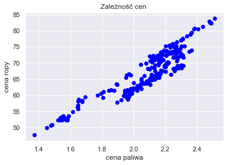
    


Narysuję również histogram reszt, by zobaczyć, jak się rozkładają.


```python
reszty = wynik.resid
x = np.linspace(min(reszty), max(reszty), 100)

plt.hist(reszty, density = True)
plt.plot(x, st.norm.pdf(x, loc = np.mean(reszty), scale = np.std(reszty)), color = 'red')
plt.show()
```


    
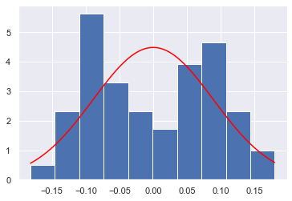
    


Jak widać reszty nie mają rozkładu normalnego. Ich rozkład cechuje się dwumodalnością.

Wykonam teraz model liniowy, do wykonania którego posłużę się wszystkimi posiadanymi zmiennymi.


```python
regresja = smf.ols(formula = 'paliwo ~ ropa + brent + zloto + srebro + miedz + aluminium + gaz_ziemny + woda + cukier + kawa + pszenica + kukurydza', data = df)
wynik = regresja.fit()
print(wynik.summary())
```

                                OLS Regression Results                            
    ==============================================================================
    Dep. Variable:                 paliwo   R-squared:                       0.969
    Model:                            OLS   Adj. R-squared:                  0.967
    Method:                 Least Squares   F-statistic:                     546.9
    Date:                Wed, 22 Jun 2022   Prob (F-statistic):          1.06e-152
    Time:                        19:46:06   Log-Likelihood:                 397.58
    No. Observations:                 226   AIC:                            -769.2
    Df Residuals:                     213   BIC:                            -724.7
    Df Model:                          12                                         
    Covariance Type:            nonrobust                                         
    ==============================================================================
                     coef    std err          t      P>|t|      [0.025      0.975]
    ------------------------------------------------------------------------------
    Intercept      0.8410      0.155      5.432      0.000       0.536       1.146
    ropa           0.0343      0.005      7.127      0.000       0.025       0.044
    brent         -0.0087      0.005     -1.603      0.110      -0.019       0.002
    zloto         -0.0006      0.000     -5.205      0.000      -0.001      -0.000
    srebro        -0.0022      0.006     -0.349      0.727      -0.014       0.010
    miedz          0.2514      0.033      7.701      0.000       0.187       0.316
    aluminium     -0.0001   5.18e-05     -2.762      0.006      -0.000   -4.09e-05
    gaz_ziemny    -0.0383      0.011     -3.370      0.001      -0.061      -0.016
    woda           0.0005   4.12e-05     11.606      0.000       0.000       0.001
    cukier         0.0055      0.005      1.087      0.278      -0.005       0.016
    kawa          -0.0006      0.000     -1.802      0.073      -0.001     5.3e-05
    pszenica       0.0001      0.000      0.918      0.360      -0.000       0.000
    kukurydza     -0.0007   9.79e-05     -7.349      0.000      -0.001      -0.001
    ==============================================================================
    Omnibus:                        4.607   Durbin-Watson:                   0.476
    Prob(Omnibus):                  0.100   Jarque-Bera (JB):                4.914
    Skew:                           0.196   Prob(JB):                       0.0857
    Kurtosis:                       3.607   Cond. No.                     1.79e+05
    ==============================================================================
    
    Notes:
    [1] Standard Errors assume that the covariance matrix of the errors is correctly specified.
    [2] The condition number is large, 1.79e+05. This might indicate that there are
    strong multicollinearity or other numerical problems.
    

Jak widać wartości *brentu*, *srebra*, *cukru*, *kawy*, *pszenicy* nie są istotnie różne od zera, a więc można usunąć je z modelu.

W końcowym efekcie model wyglądał by w następujący sposób:
    
$paliwo = 0,841 + 0,0343 * ropa - 0.0006 * złoto + 0.2514 * miedź - 0.0001 * aluminium - 0.0383 * gaz ziemny + 0.0005 * woda - 0.0007 * kukurydza$

Co ciekawe, według modelu najsilniej skorelowana z wartością *paliwa* jest wartość *miedzi*, nawet bardziej niż wartość *ropy*.
Może to wynikać z tego, że cena ropy w znaczym stopniu warunkuje koszt pozyskiwania, bądź obróbki *miedzi*.

## Testowanie modelu

Teraz dokonam testowania modelu na danych z początku obecnego roku (od 1 styczna 2022 do 1 czerwca 2022)

W tym celu ze strony *Yahoo finance* pobiorę dane z tego okresu i w analogiczny sposób jak poprzednio przygotuję do użytku.


```python
gasoline_wyk = yf.download(tickers='RB=F', start = '2022-01-01', end = '2022-06-01')
crude_t = yf.download(tickers='CL=F', start = '2022-01-01', end = '2022-06-01')
brent_t = yf.download(tickers='BZ=F', start = '2022-01-01', end = '2022-06-01')
wheat_t = yf.download(tickers='ZW=F', start = '2022-01-01', end = '2022-06-01')
gold_t = yf.download(tickers='GC=F', start = '2022-01-01', end = '2022-06-01')
silver_t = yf.download(tickers='SI=F', start = '2022-01-01', end = '2022-06-01')
sugar_t  = yf.download(tickers='SB=F', start = '2022-01-01', end = '2022-06-01')
copper_t = yf.download(tickers='HG=F', start = '2022-01-01', end = '2022-06-01')
nat_gas_t = yf.download(tickers='NG=F', start = '2022-01-01', end = '2022-06-01')
water_t = yf.download(tickers='H2O=F', start = '2022-01-01', end = '2022-06-01')
aluminium_t = yf.download(tickers='ALI=F', start = '2022-01-01', end = '2022-06-01')
coffe_t = yf.download(tickers='KC=F', start = '2022-01-01', end = '2022-06-01')
corn_t = yf.download(tickers='ZC=F', start = '2022-01-01', end = '2022-06-01')
```

    [*********************100%***********************]  1 of 1 completed
    [*********************100%***********************]  1 of 1 completed
    [*********************100%***********************]  1 of 1 completed
    [*********************100%***********************]  1 of 1 completed
    [*********************100%***********************]  1 of 1 completed
    [*********************100%***********************]  1 of 1 completed
    [*********************100%***********************]  1 of 1 completed
    [*********************100%***********************]  1 of 1 completed
    [*********************100%***********************]  1 of 1 completed
    [*********************100%***********************]  1 of 1 completed
    [*********************100%***********************]  1 of 1 completed
    [*********************100%***********************]  1 of 1 completed
    [*********************100%***********************]  1 of 1 completed
    


```python
dane2=pd.DataFrame({'ropa':crude_t.Close,
                   'brent':brent_t.Close,
                   'zloto':gold_t.Close,
                   'srebro':silver_t.Close,
                   'miedz':copper_t.Close,
                   'aluminium':aluminium_t.Close,
                   'gaz_ziemny':nat_gas_t.Close,
                   'woda':water_t.Close,
                   'cukier':sugar_t.Close,
                   'kawa':coffe_t.Close,
                   'pszenica':wheat_t.Close,
                   'kukurydza':corn_t.Close})
```


```python
df2 = dane2.dropna()
```


```python
paliwo_p = wynik.predict(df2)
```


```python
df_p = pd.DataFrame({'faktyczna':gasoline_wyk.Close,
                    'oczekiwana':paliwo_p})
```


```python
plt.rcParams["figure.figsize"] = (14,6)
plt.plot(df_p.faktyczna, "b-", label="Faktyczna wartość")
plt.plot(df_p.oczekiwana, "r", label="Przewidywana wartość")
plt.legend(loc="best")
plt.xlabel("Data")
plt.ylabel("Wartość paliwa [$]")
plt.title("Porównanie wartości faktycznej z przwidywaną")
plt.show()
```


    
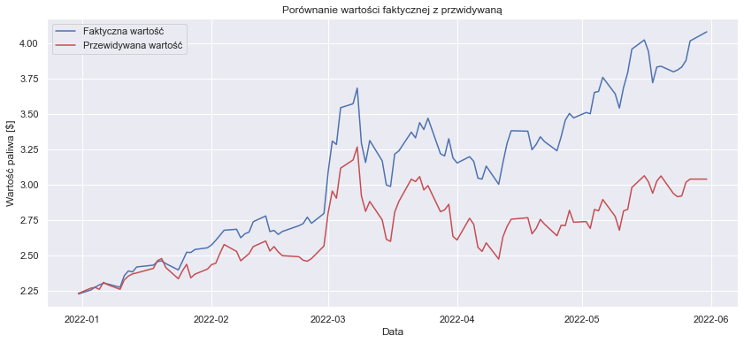
    


Jak widać z czasem wartości przewidywane "rozjeżdżają się", mimo to oba wykresy zachowują podobny kształt, co widać na przykładzie dużego skoku wartości paliwa na przełomie lutego i marca, a także jej spadku na początku kwietnia.


```python

```
